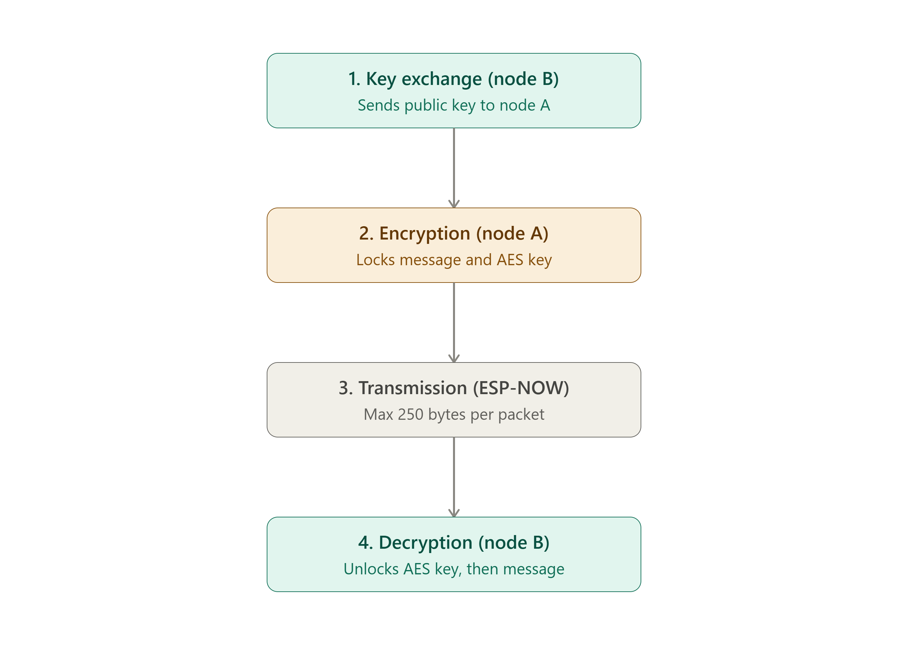
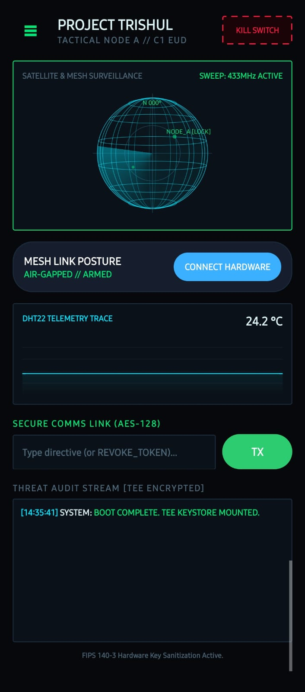
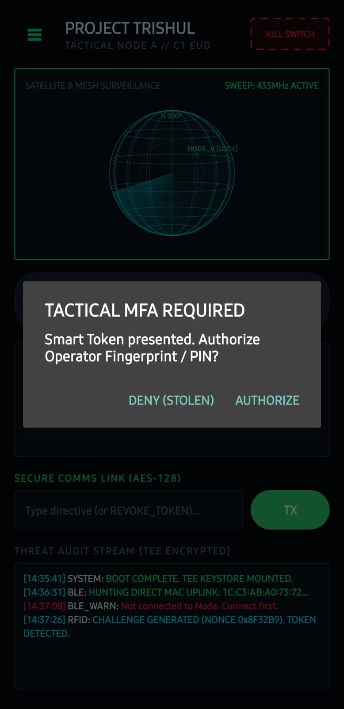
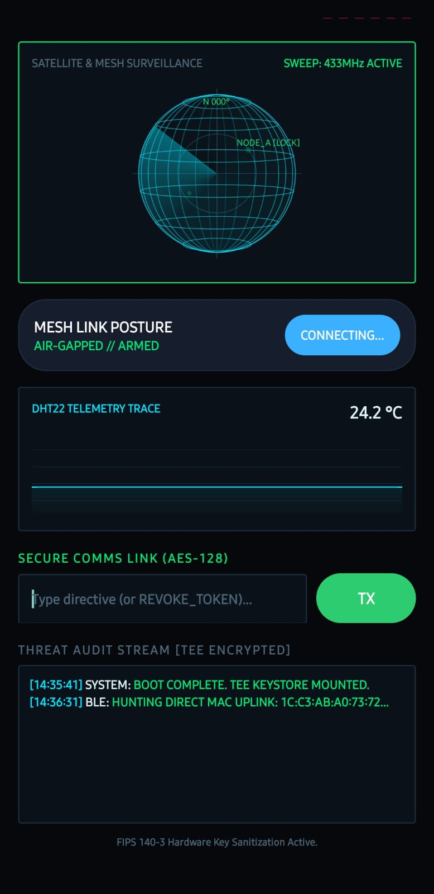
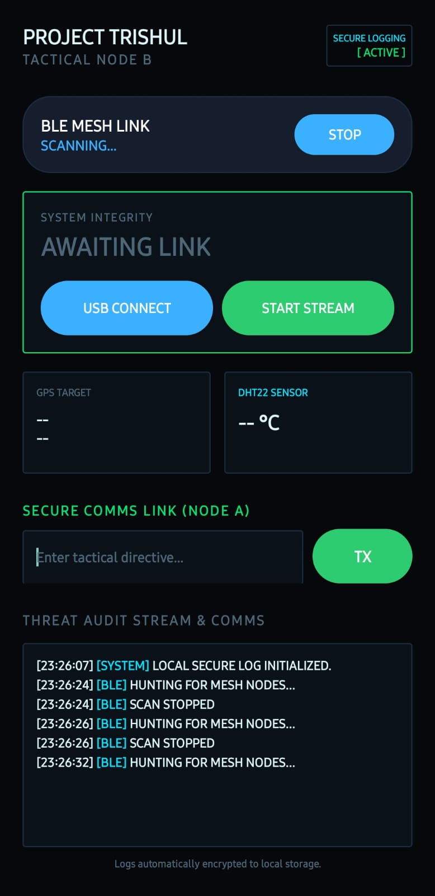
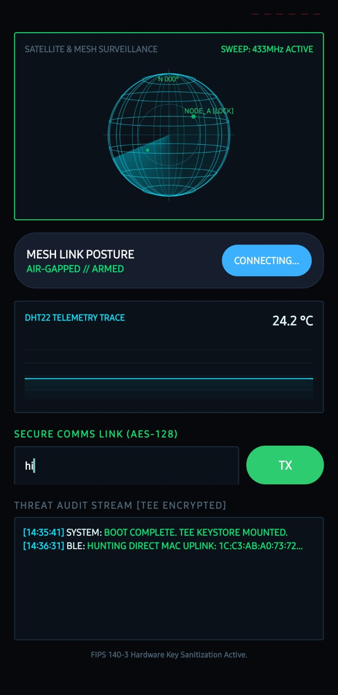
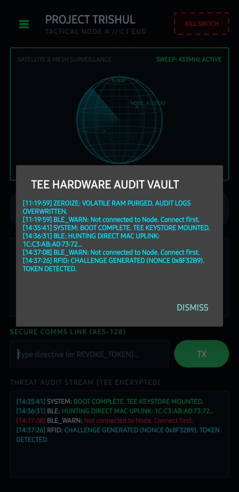
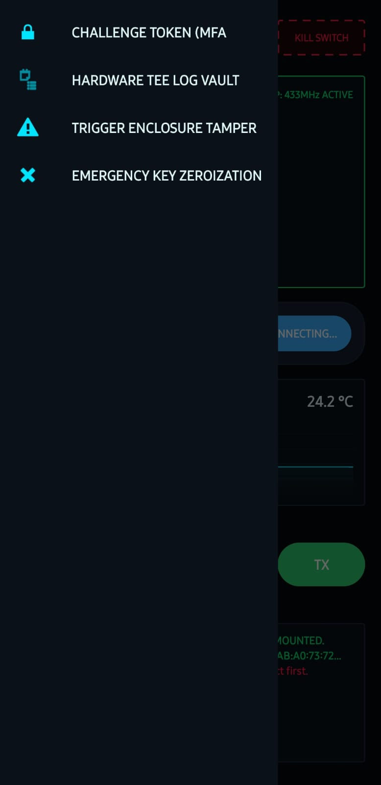
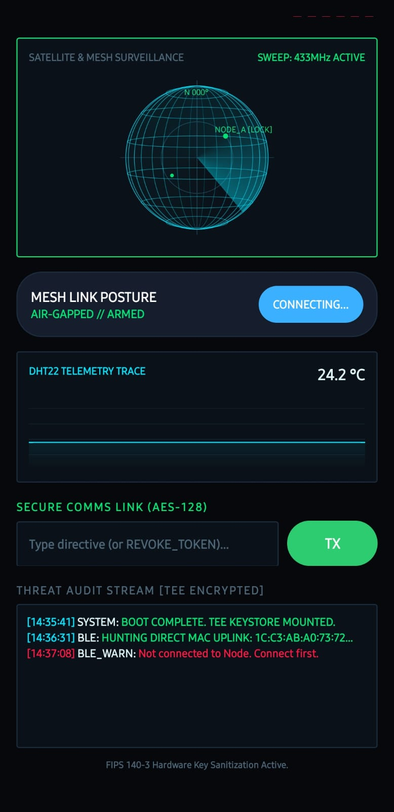
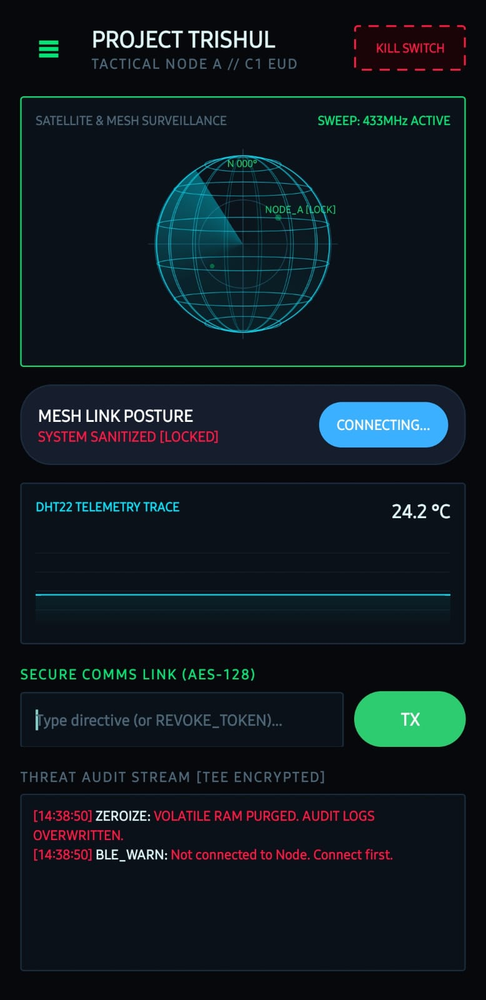

# PROJECT TRISHUL
### Tactical Air-Gapped C2 & Anti-Tamper Mesh Communication Framework

*A resilient tactical command-and-control (C2) communication network operating entirely off-grid without internet, satellite relays, or cellular infrastructure.*

---

## Executive Overview
**Project Trishul** is a hardware-enforced, off-grid communication framework engineered for contested tactical environments. Utilizing paired **ESP32 edge nodes** and **Android End User Devices (EUDs)**, Trishul forms a low-latency, point-to-point mesh network resilient against electronic warfare, surveillance sniffing, and physical enclosure capture.

The architecture decouples the primary human interface (Android EUD) from the RF broadcast domain by deploying an autonomous Bluetooth Low Energy (BLE) tether to a dedicated ESP32 tactical node, bridging packets over low-level 2.4GHz IEEE 802.11 action frames (**ESP-NOW**).

---

## Cryptography & Architecture Flow

  

### Security Specifications
| Vector | Implementation | Threat Model Countered |
| :--- | :--- | :--- |
| **Physical Tamper** | Ground-referenced microswitch on GPIO 5 | Prevents chassis penetration. Tripping the switch triggers immediate volatile RAM purging. |
| **Air-Gap Traversal** | Ad-hoc ESP-NOW action frames | Eliminates cell tower/router association footprint, immune to standard IP routing intercepts. |
| **Audit Integrity** | Android Jetpack Security (`EncryptedFile`) | Audit trails encrypted locally on the mobile EUD using AES-256 GCM backed by the Android TEE Keystore. |
| **Hybrid Crypto** | AES + Asymmetric Key Exchange | Node encrypts the payload symmetrically, then encapsulates the session key asymmetrically for secure transmission. |

---

## Tactical EUD Interface (Android App)

| Secure Boot | MFA Authentication | Hardware Scanning |
| :---: | :---: | :---: |
|  |  |  |
| **Boot Sequence** | **Biometric / RFID Challenge** | **Hunting MAC Uplink** |

| C2 Dashboard | Secure Messaging | Audit Vault |
| :---: | :---: | :---: |
|  |  |  |
| **Telemetry & Threat Status** | **Off-Grid Mesh Comms** | **TEE Encrypted Logs** |

| Navigation | Link Lost | Zeroize Protocol |
| :---: | :---: | :---: |
|  |  |  |
| **App Drawer** | **Air-Gap Broken** | **RAM Purged / Keys Wiped** |

---

## Hardware Pinout Matrix

### Node A (Tactical Transmitter)
| Component | Pin / Bus | ESP32 GPIO | Description |
| :--- | :--- | :--- | :--- |
| **DHT22 Sensor** | Data | `GPIO 4` | Ambient temperature/telemetry stream |
| **Tamper Switch** | Normal-Close to GND | `GPIO 5` | Hardware-pulled anti-breach line |
| **Status LED** | Anode | `GPIO 2` | Onboard link/activity pulse |

### Node B (Tactical Receiver)
| Component | Pin / Bus | ESP32 GPIO | Description |
| :--- | :--- | :--- | :--- |
| **WS2812 RGB Ring** | DIN | `GPIO 13` | Tactical threat status indicator |
| **Active Buzzer** | Positive (+) | `GPIO 14` | Audio alarm signaling |
| **SPI Expansion** | MISO / MOSI / SCK | `GPIO 19 / 23 / 18` | Hardware bus reserved for RF payloads |

---

## Installation & Deployment

### 1. MicroPython Firmware (ESP32)
1. Flash `firmware/node_a/main.py` to Node A using Thonny or `mpremote`.
2. Flash `firmware/node_b/main.py` to Node B.
3. Verify via serial output that both nodes register onto ESP-NOW Channel 1.

### 2. Tactical EUD Android App
1. Open the project in Android Studio.
2. For Device 1 (Node A Controller): Update `TARGET_MAC_ADDRESS` in `MainActivity.kt` with Node A's MAC address and deploy.
3. For Device 2 (Node B Receiver): Update `TARGET_MAC_ADDRESS` with Node B's MAC address and deploy.
